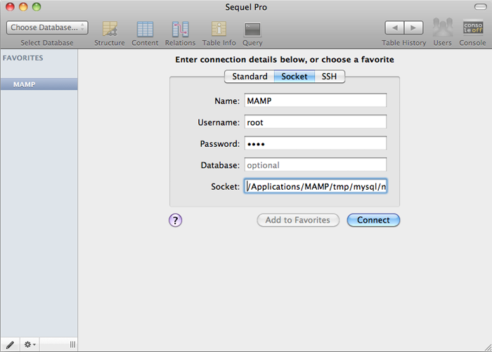

<!--data 2010-09-27 -->

# Local DB

I used to rely heavily on [phpMyAdmin](http://www.phpmyadmin.net/home_page/index.php) during web development. It was particularly useful before I began using frameworks like Rails and ExpressionEngine, which 99% of the time automatically generate my database needs and allow me to manipulate them by other means. For a time phpMyAdmin was an indispensable tool for interacting with the database. I still herald it as a great tool for any web developer, and being prepackaged with [MAMP](http://www.mamp.info/) makes it an obvious solution for managing local databases while developing on a Mac.

That useless backstory being said, my workflow has been changing lately, and I'm growing to really like using [Sequel Pro](http://www.sequelpro.com/). This is petty, but when you are working in multiple environments, keeping track of phpMyAdmin deployments through various bookmarks becomes a minor annoyance. Using a desktop application like Sequel Pro allows me to connect to production, local development and test environments all from one central location. It's also done really well.

It took me a bit of tinkering to figure out how to connect to my MAMP MySQL through Sequel Pro, so I figured I'd share the tip. The trick is to use a socket connection, and connect to `/Applications/MAMP/tmp/mysql/mysql.sock`.

_If these settings don't work for you, note that I am using Sequel Pro 0.9.8.1 and MAMP 1.7.2. Also, note that the default MAMP root password for MySql is also `root`_
