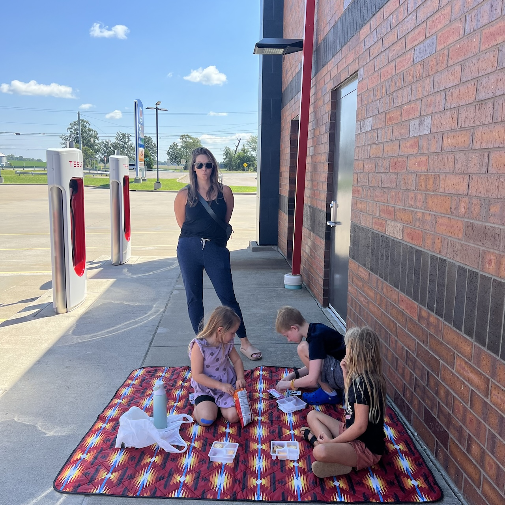
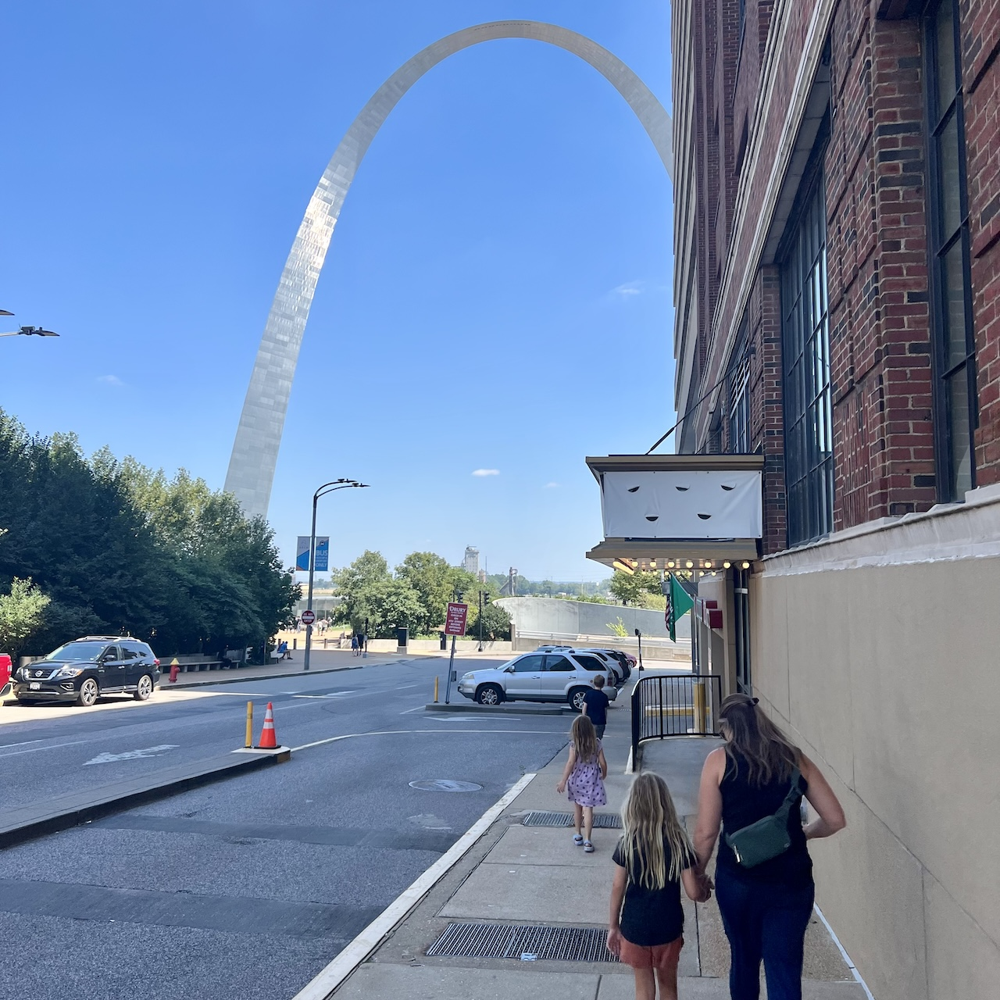

<template data-parse>2024-08-18 #itsroadtrip</template>

# St. Louis

We left Lexington one year ago, today. Not forever, but for a season. Our single car family packed into the Tesla Model Y for a semester on the road with five people, seven seats, and five bags. A haiku on wheels, following forms of travel, composed for sharing. 

Honestly there were more than five bags. There was a backpack for each child, two travel backpacks outfitted with packing pouches of varying volumes, my briefcase that doubles as a backpack when reconfiguring the straps, and the Columbia backpack that would be replaced with a Fjallraven upgrade. That’s seven, and does not include the shoulder bags and bum bags packed away for smaller excursions. 

Rubbermaid bins housed additional items. I’m pretty sure there was a pack away cooler. The charging paraphernalia and emergency water bottles filled out the frunk. There was no room for a spare tire, and no need for a jack without a spare. 

St. Louis is west on I-64. We took Versailles road to get to the interstate, passing the horse track at Man O War Boulevard and the castle at Pisgah Pike. Driving to Louisville is uneventful. Some bridges take you over trouble-free water. Some stretches are carved into the terrain exposing the limestone. Horses show up beyond the painted fences. 

Then there’s Louisville. I’ve never understood the appeal. I saw DragonForce, Death Cab for Cutie, and Jerry Seinfeld at The Palace in my twenties on separate occasions. Other than the population density to draw larger acts, Louisville seems forgettable. Go Cats. 

Our first charging stop was at a Casey’s in Indiana. We ventured into the convenience to assemble a lunch. The first of many shops where we would train our children against the impulse to buy something of fleeting value at every stop. Lunchables for the kids. Prosciutto wrapped around mozzarella for me. Emily stuck to the pre-packed snacks, and I recall pumpkin seeds specifically. 

Our picnic blanket was spread on concrete in the shade of the car wash. Cleanliness was present within and without. The timing of a full charge was perfect for refueling our vehicle and relieving ourselves. We packed it back in and continued west. 

We made it to the St. Louis Arch by midday. The first National Park on our adventure. The Museum called attention to St. Louis as the starting point of Louis and Clark’s expedition west. The miniatures in the museum carried plenty of detail to get lost in. There were six sections in total, and children’s curriculum to match. We got a smoothie and some Cheetos at the gift shop. The kids took their first Junior Ranger pledge and were rewarded with a badge. We did not take the elevator to the top. A kind couple from Pittsburgh commented on my Pirates hat. Go Bucs.

We spent the first night at a friend’s apartment. They showed us around the neighborhood, including [Taco Buddha](https://tacobuddha.com/) where we achieved enlightenment. A nearby park provides space for kids to burn off their energy. Arrangements were provided for all five of us to sleep comfortably. 

I did not see Nelly or listen to Country Grammar while I was in St. Louis. Which is dissapointing, but understandable.

