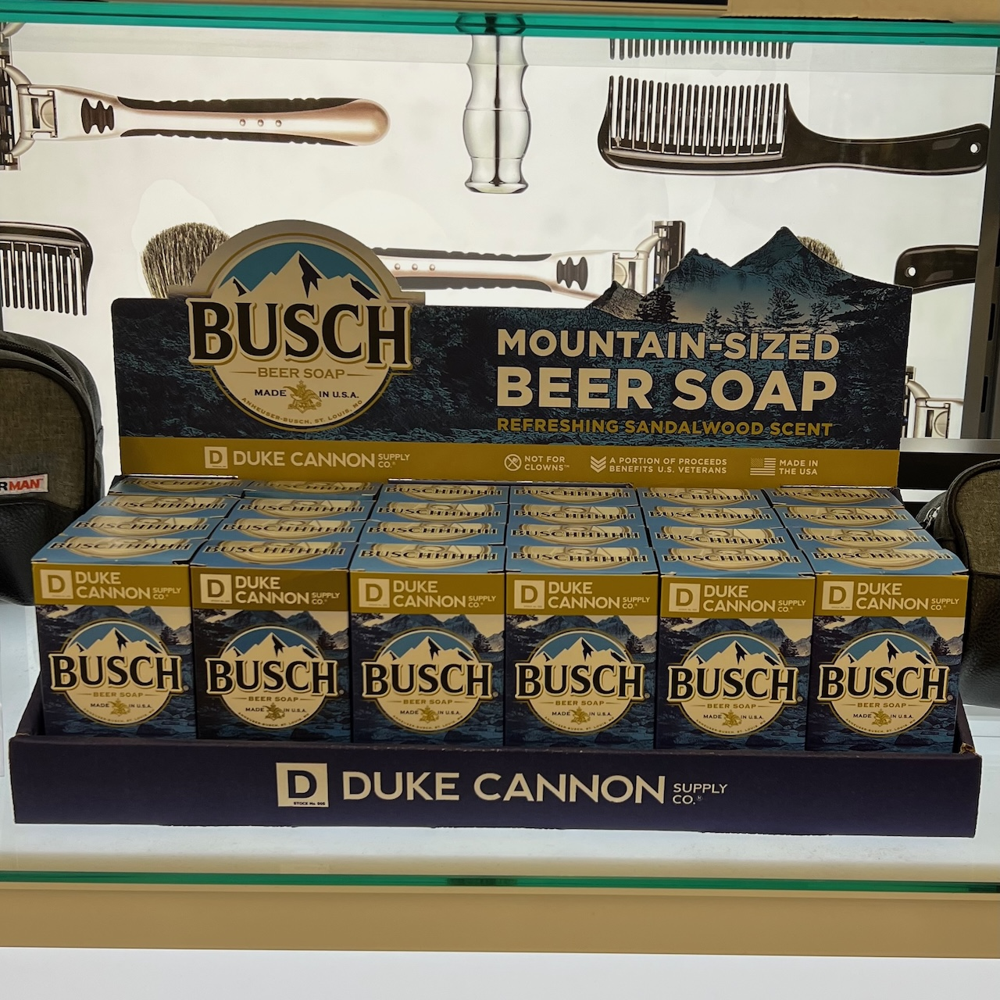

<template data-parse>2024-08-20 #itsroadtrip</template>

# Sioux City or Falls

Our St. Louis hosts treated us to fruit, pastries, and coffee. We shared our ~~goodbyes~~ see-you-laters, supercharged, and headed down the road. 

We aimed our day at Sioux City, Sioux Falls, or somewhere in between. Driving was uneventful based on my photo evidence. 

We stopped for lunch and electrons at Dempsey's BBQ in Concordia, MO. Is this the Kansas City BBQ that everyone is on about? The sweet tea and smoked meats were adequate. Dempsey's did not displace Terry Black's of Austin, TX as the BBQ king of my taste buds. The supercharger outside did have windshield wands to wipe the morning off our windshield. 

We ended up making it all the way to Sioux Falls, SD. I know that because I took a picture of this beer soap at the Hy-Vee. Hy-Vee seems to be South Dakota's version of a fancy Kroger, Meijer, Fred Meyer, etc. I was walking around the store while the car charged in the parking lot. 

After charging completed I moved from the charger to the gas station for another windshield washing. The bugs of the afternoon and evening were heavier than those of the morning, but were washed away all the same. I returned to the hotel and to family to get some rest. 