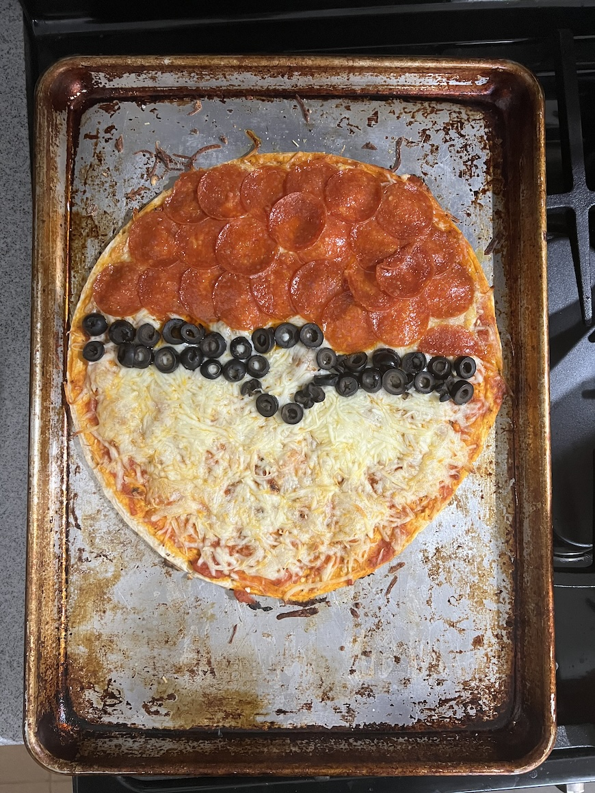

<template data-parse>2024-02-25 #weeknotes</template>

# Weeknotes: 2024, Week 8

This was the most normal week we’ve had all year. And it was slightly abnormal. 

Emily was away at a resort until Wednesday evening. Grandparents came to share the load of parenting. Their help allowed me to keep up with running, lifting, and work routines. 

A pork loin was slow roasting, when intentions were standard roasting. The temperature gauge in our oven may be busted. Or perhaps just covered in soot from the oven fire we experienced. I deep cleaned the oven as a next step in finding the problem. Next bake seemed better. 

We picked Emily up from the airport on Wednesday and dined at Asian Wind. Leftovers for days. 

A friend gave us a sourdough starter. I’m relearning how to care and feed for a mother.  

E and I are perusing perfection on Mario vs Donkey Kong. We’ve got all the gold stars up to the final world. 

I’m ditching Apple Notes in favor of Bear. My annoyance at Apple Notes broken experiences reached a tipping point. Filtering by tags wasn’t working. Searching for a term with correct spelling and correct capitalization wasn’t finding my notes. Even when I was staring strait at the manually found note in the sidebar as a test. The process of migrating my 1500+ notes spanning 15’ish years has been a trip. I’m up into 2020.

Bloodwork this week as part of my annual exam with my new doctor. They were thorough. I’m thankful to have access to healthcare as I make a best effort to age well. 

Made a Pokéball pizza. It was delicious. 

