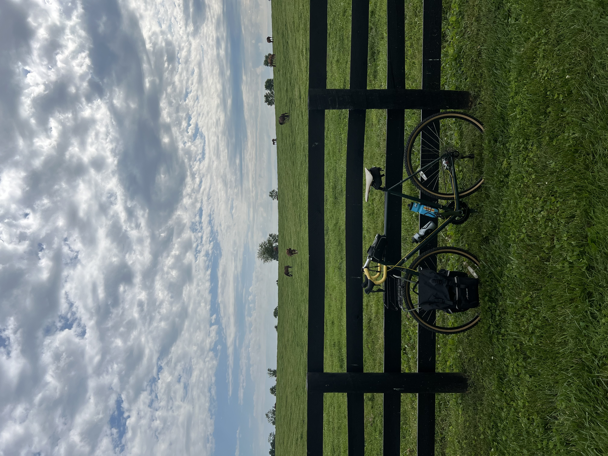

<template data-parse>2024-06-16 #weeknotes</template>

# Weeknotes: 2024, Week 24

Back to routine after returning from Asheville. I was in a funk this week on all fronts of life. It’s one of those eras where nothing in particular is *wrong*, but nothing seems to be clicking in to place the way it usually does.

Swimming as a kids sport is the foundation of our summer routines. The out-the-door routine takes place later than school days, which has its pros and cons. Pro is that kids can sleep later and are better rested for the day. Con is that I’m taking a break just as I get into the morning groove...or starting work a little bit later than I’m used to during the school year.

I realized that I had been around people with zero solitude for about three week straight. So I hopped on my bike on Friday and rode 50 miles. The first time I had done that in over 2 years. I felt strong most of the time.  Eating BBQ as the lunch mid-ride was a delicious heavy mistake. 

Father’s day was low key. We went to church, built legos, ate Chipotle, and watched a movie.

